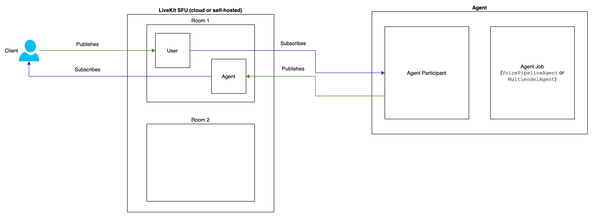

# Prototype: Telephony Speech-To-Speech (STS) with OpenAI, LiveKit and Twilio

- **Authors:** Sakthi Santhosh
- **Created on:** 22/02/2025

## Introduction

LiveKit is an open-source WebRTC SFU that powers scalable, low-latency real-time communications, such as OpenAI's Speech-To-Speech system. Instead of relying on resource-intensive MCU architectures, LiveKit efficiently forwards media streams to support dynamic room and participant management. The platform enables flexible agent registration and dispatching, allowing developers to build everything from basic conferencing tools to advanced multimodal applications with ease.

## Why LiveKit?

OpenAI uses WebRTC for real-time STS communication. However, it is inherently a peer-to-peer (P2P) protocol, where two peers exchange audio and video ("media") directly, bypassing central servers. This works well for a small number of users, typically up to three. Since most users lack the bandwidth required to simultaneously upload multiple high-resolution video streams, scaling WebRTC beyond a few participants necessitates a client-server model.

LiveKit instead adopts a Selective Forwarding Unit (SFU) model, which acts as a specialized media router. Instead of processing media streams, the SFU forwards them directly to subscribers without alteration. This approach allows for greater scalability and flexibility. Each participant sends a single uplink stream, which the SFU distributes to other users as needed.

> SFU, to put it in simple terms, is a broker that connects two or more participants in a namespace/room. This architecture lets the AI agents and participants scale individually.



## Setup

To setup the project, please complete the following steps prior:

1. **Twilio Outbound Trunk**: We need to setup an outbound trunk in Twilio through which LiveKit with initite calls to people. LiveKit communicates with Twilio with SIP protocol. For more info on how this works and setting up SIP trunk with Twilio, please refer this [article](https://docs.livekit.io/sip/quickstarts/configuring-twilio-trunk/#configure-a-sip-trunk-using-the-twilio-ui).
2. **Set-up LiveKit:** Make sure you have a project setup with LiveKit. Under the project settings, get the API keys for the LiveKit cloud. We'll be using this to let the agent communicate with the LiveKit cloud.

## Usage

You can register the Twilio outbound trunk with LiveKit CLI, or use the utility program given:

```python
python3 ./utils.py create_trunk
```

If you have the necessary environment variables filled, some details will be filled automatically for you. If not, you can manually enter the details.

The agent can work with either `VoicePipelineAgent` or `MultimodalAgent`. Here's the difference between them:

1. **`MultimodalAgent`**: Uses OpenAI’s multimodal model and realtime API to directly process user audio and generate audio responses, similar to OpenAI’s advanced voice mode, producing more natural-sounding speech.
2. **`VoicePipelineAgent`**: Uses a pipeline of STT, LLM, and TTS models, providing greater control over the conversation flow by allowing applications to modify the text returned by the LLM.

You can choose which API to use by tweaking the code. You can also modify the function calling methods by modifying the `CallActions` class.

Run the agent as follows, which will connect to the LiveKit server and initiate an outbound call to the user when _dispatched_:

```bash
python3 ./agent.py dev
```

To dispatch the agent, we explicitly dispatch it by running the following command:

```bash
lk dispatch create \
    --new-room \
    --agent-name outbound-caller \
    --metadata "+15105550100"
```

We are passing the callee's phone number in the metadata that'll be picked up by the agent and used to initiate the call.
